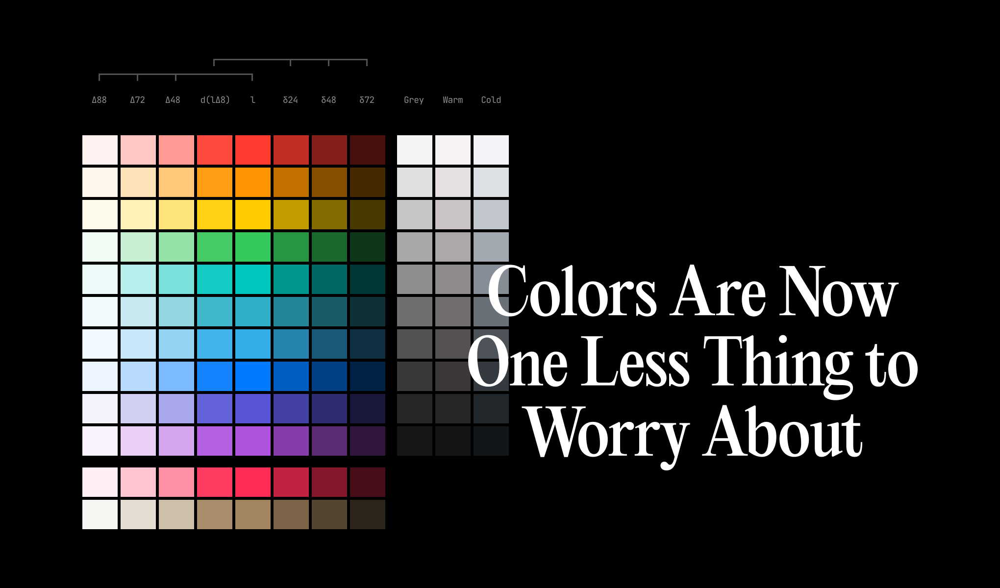

# New UI Colors



## Install
Install New UI Colors from your terminal via npm.

```
npm i @new-ui/colors
```

To get started quickly, you can use the CDN files.
 
```html
<!-- Place this at the html head -->
<link rel="stylesheet" href="https://cdn.jsdelivr.net/npm/@new-ui/colors@<version>/dist/index.css">
```

## Usage

```scss
// Place this at the top of your SCSS/CSS file
@import "@new-ui/colors";
```

```html
<!-- Add this attribute to html wrapper -->
<html data-new-ui-theme="light">
```

### Available themes
- light
- light--warm
- light--cold

## Build

To build css

```
npm install
npm run build
```

## Recommended Defaults
Refer to the Figma file for the color tokens cheatsheet.

[Get a Figma copy](https://www.figma.com/community/file/1179503548902179413)

## Usage Guide

- Tokens defined in the figma file matches variables declared in CSS
- All classes associated with the design system are prefixed with a global namespace followed by a hyphen: `nu-`
- In addition to a global namespace, we added prefixes to each class to make it more apparent what job that class is doing using BEM syntax
  * `c-` for UI components, such as `.nu-c-h1` or `.nu-c-card`
  * `l-` for layout-related styles, such as `.nu-l-grid__item` or `.nu-l--two-column`
  * `u-` for utilities, such as `.nu-u-mb-<spacing-token>` or `.nu-u-margin-bottom-pt2`
  * `is-` and has- for specific states, such as `.nu-is-active` or `.nu-is-disabled`. These state-based classes - would apply to
  * `js-` for targeting JavaScript-specific functionality, such as `.js-modal-trigger`. No styles are bound to these classes; they’re reserved for behavior only. For most cases, these `js-` classes would toggle - state-based classes to an element.