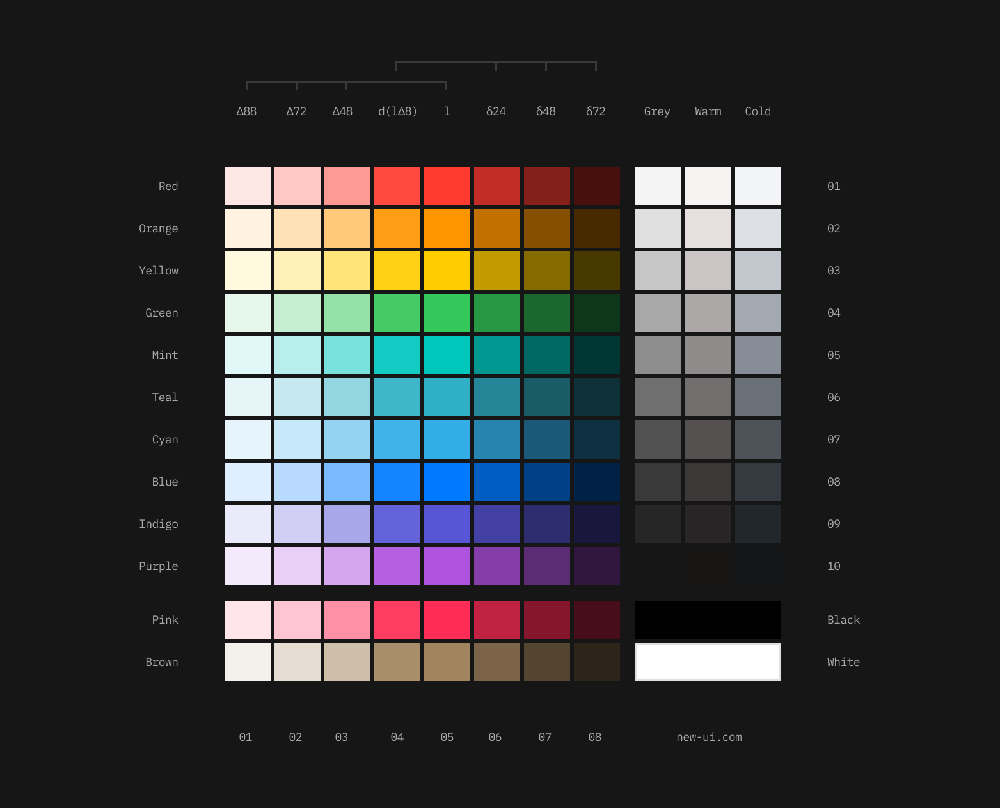

## Install
Install New UI Colors from your terminal via npm. Current version is 0.2.0

```
npm i @new-ui/colors
```

To get started quickly, you can use the CDN files.

Light theme: 
```
<link rel="stylesheet" href="https://cdn.jsdelivr.net/npm/@new-ui/colors@0.2.0/dist/themes/light.css">
```

Dark theme: 
```
<link rel="stylesheet" href="https://cdn.jsdelivr.net/npm/@new-ui/colors@0.2.0/dist/themes/dark.css">
```

## Build

To build themes from tokens.

```
npm install
```

Light theme: 
```
npm run build:tokens -- --theme=light
```

Dark theme: 
```
npm run build:tokens -- --theme=light
```

## Get a Figma copy

[New UI Colors - Light](https://www.figma.com/community/file/1179503548902179413)
