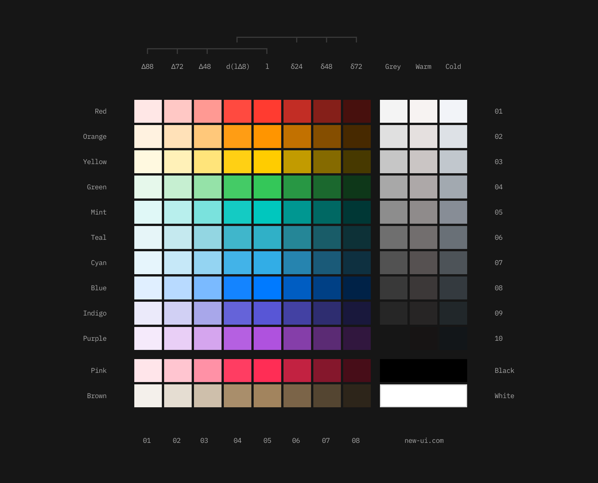

## Install
Install New UI Colors from your terminal via npm. Current version is 1.0.0

```
npm i @new-ui/colors
```

To get started quickly, you can use the CDN files.

Light themes: 
```
<link rel="stylesheet" href="https://cdn.jsdelivr.net/npm/@new-ui/colors@1.0.0/dist/themes/light.css">
```
```
<link rel="stylesheet" href="https://cdn.jsdelivr.net/npm/@new-ui/colors@1.0.0/dist/themes/light-warm.css">
```
```
<link rel="stylesheet" href="https://cdn.jsdelivr.net/npm/@new-ui/colors@1.0.0/dist/themes/light-cold.css">
```

Dark themes: 
```
<link rel="stylesheet" href="https://cdn.jsdelivr.net/npm/@new-ui/colors@1.0.0/dist/themes/dark.css">
```
```
<link rel="stylesheet" href="https://cdn.jsdelivr.net/npm/@new-ui/colors@1.0.0/dist/themes/dark-warm.css">
```
```
<link rel="stylesheet" href="https://cdn.jsdelivr.net/npm/@new-ui/colors@1.0.0/dist/themes/dark-cold.css">
```

## Build

To build themes from tokens.

```
npm install
```

Light themes: 
```
npm run build:tokens -- --theme=light
npm run build:tokens -- --theme=light-warm
npm run build:tokens -- --theme=light-cold
```

Dark themes: 
```
npm run build:tokens -- --theme=dark
npm run build:tokens -- --theme=dark-warm
npm run build:tokens -- --theme=dark-cold
```

## Cheatsheet
Refer to the Figma file for the color tokens cheatsheet.

[Get a Figma copy](https://www.figma.com/community/file/1179503548902179413)
